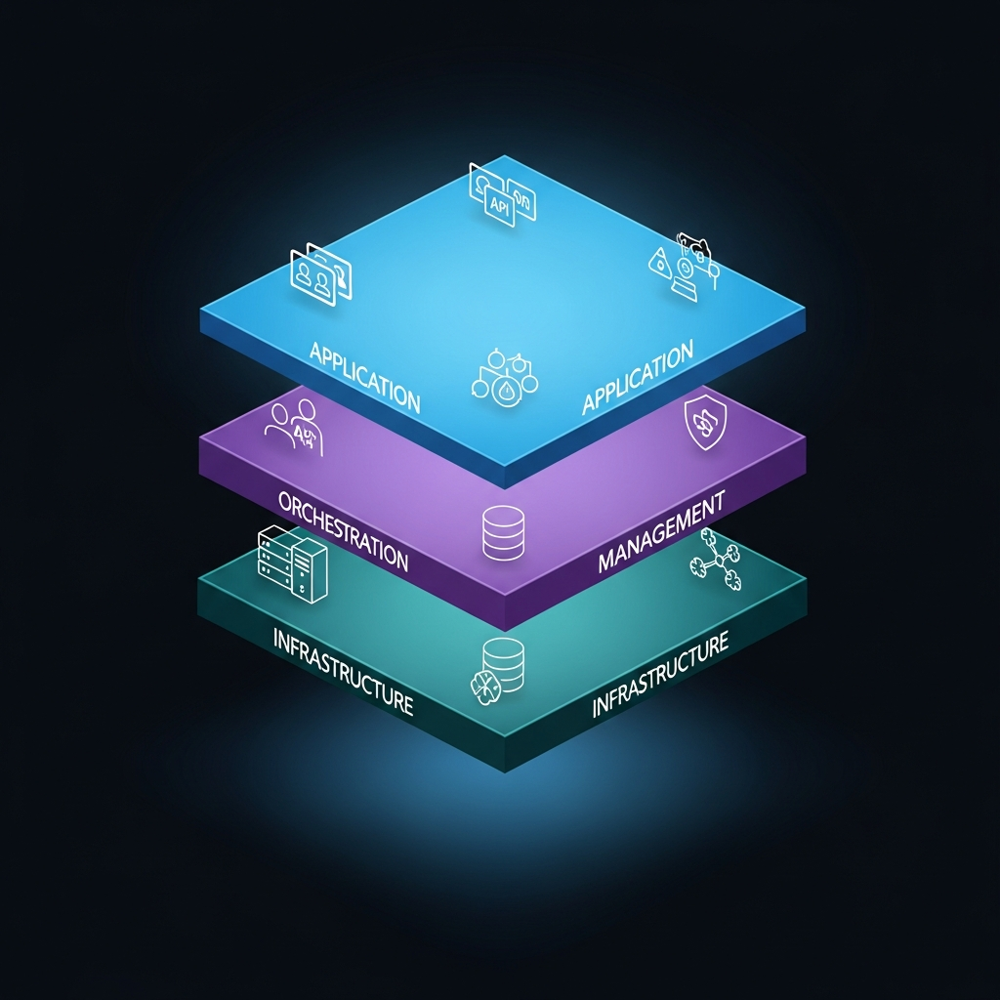
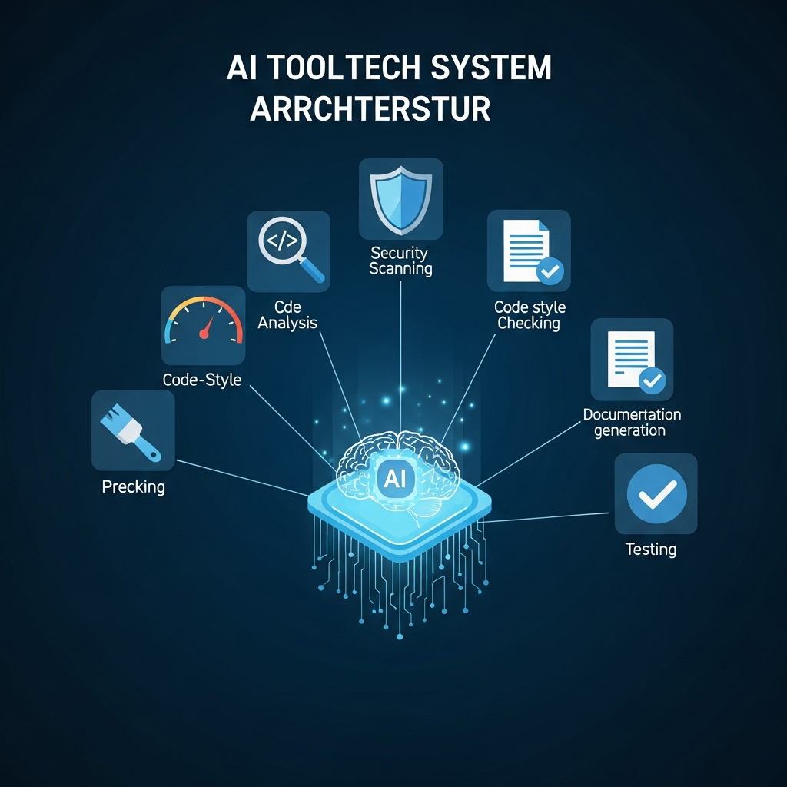
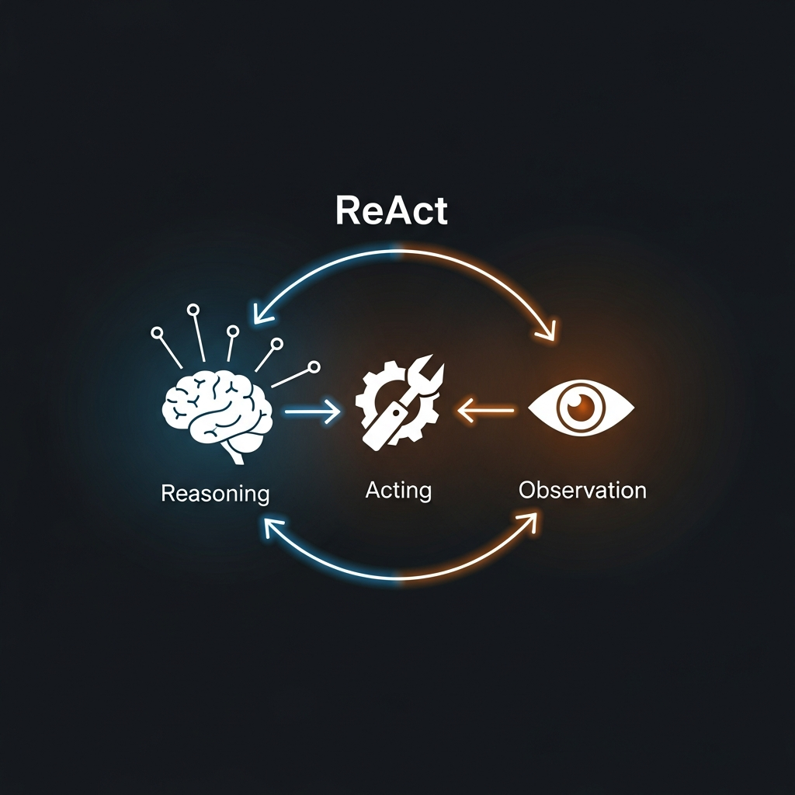

# AgentScope 框架学习指南 —— 以代码审查 Agent 为例

<p align="center">
  
</p>

<p align="center">
  <em>基于 AgentScope Java SDK 实现的智能代码审查 AI Agent 项目，同时作为 AgentScope 框架的学习教程。</em>
</p>

---

## 目录

- [一、AgentScope 框架概览](#一agentscope-框架概览)
  - [1.1 什么是 AgentScope](#11-什么是-agentscope)
  - [1.2 框架定位与特色](#12-框架定位与特色)
  - [1.3 与其他 Agent 框架的对比](#13-与其他-agent-框架的对比)
- [二、核心概念详解](#二核心概念详解)
  - [2.1 Agent（智能体）](#21-agent智能体)
  - [2.2 Message（消息）](#22-message消息)
  - [2.3 Tool & Toolkit（工具系统）](#23-tool--toolkit工具系统)
  - [2.4 Memory（记忆）](#24-memory记忆)
  - [2.5 Pipeline（流水线编排）](#25-pipeline流水线编排)
  - [2.6 ReAct 模式](#26-react-模式)
- [三、Java SDK 架构](#三java-sdk-架构)
  - [3.1 核心包结构](#31-核心包结构)
  - [3.2 模型支持](#32-模型支持)
  - [3.3 Spring Boot 集成](#33-spring-boot-集成)
  - [3.4 响应式编程模型](#34-响应式编程模型)
- [四、本项目实战解析](#四本项目实战解析)
  - [4.1 项目结构](#41-项目结构)
  - [4.2 核心配置解析](#42-核心配置解析)
  - [4.3 工具开发详解](#43-工具开发详解)
  - [4.4 Agent 服务层](#44-agent-服务层)
  - [4.5 完整调用链路](#45-完整调用链路)
- [五、多 Agent 协作模式](#五多-agent-协作模式)
- [六、快速开始](#六快速开始)
- [七、进阶学习路线](#七进阶学习路线)

---

## 一、AgentScope 框架概览

### 1.1 什么是 AgentScope

AgentScope 是由**阿里巴巴通义实验室**（Tongyi Lab）开发的开源 LLM Agent 框架，最初托管在 ModelScope 组织下，现已独立为 [agentscope-ai](https://github.com/agentscope-ai) 组织。

它的核心目标是：**让开发者能够快速构建可靠的、可观测的、可扩展的 LLM 智能体应用**。

```
AgentScope 生态全景

┌─────────────────────────────────────────────────────┐
│                   AgentScope 生态                      │
│                                                       │
│  ┌──────────────┐    ┌──────────────┐                │
│  │  Python SDK  │    │   Java SDK   │                │
│  │  (22.5k ⭐)  │    │ (Spring Boot)│                │
│  └──────┬───────┘    └──────┬───────┘                │
│         │                   │                         │
│         └───────┬───────────┘                         │
│                 ▼                                      │
│  ┌─────────────────────────────┐                     │
│  │      共享核心概念             │                     │
│  │  Agent · Message · Tool     │                     │
│  │  Memory · Pipeline · ReAct  │                     │
│  └─────────────────────────────┘                     │
│                                                       │
│  模型支持: DashScope(Qwen) | OpenAI | Anthropic      │
│           | Gemini | Ollama | vLLM | DeepSeek        │
└─────────────────────────────────────────────────────┘
```

**官方资源：**
| 资源 | 地址 |
|------|------|
| Python SDK | https://github.com/agentscope-ai/agentscope |
| Java SDK | https://github.com/agentscope-ai/agentscope-java |
| Python 文档 | https://doc.agentscope.io |
| Java 文档 | https://java.agentscope.io |
| 论文 (v1.0) | https://arxiv.org/abs/2508.16279 |

### 1.2 框架定位与特色

<p align="center">
  
  <br/>
  <em>AgentScope 三层架构：应用层 / 编排管理层 / 基础设施层</em>
</p>

AgentScope 的设计哲学可以用四个关键词概括：

| 特色 | 说明 |
|------|------|
| **透明** | 每一步推理和行动都可见，没有隐藏的"黑魔法" |
| **尊重模型能力** | 不过度约束模型，而是提供工具让模型发挥最大潜力 |
| **生产就绪** | 内置 OpenTelemetry 可观测性、GraalVM 原生编译、K8s 部署支持 |
| **双语言 SDK** | Python + Java 双 SDK，是少数支持 Java 生态的 Agent 框架 |

**三层架构设计：**

```
┌─────────────────────────────────────────────┐
│            Agent 层（应用层）                  │
│  ReActAgent · Pipeline · MsgHub · 多Agent协作 │
├─────────────────────────────────────────────┤
│           Manager/Wrapper 层（管理层）         │
│  资源管理 · 容错机制 · 重试策略 · 配置管理       │
├─────────────────────────────────────────────┤
│            Utility 层（基础设施层）             │
│  模型API调用 · 代码执行 · 数据库操作 · 日志监控   │
└─────────────────────────────────────────────┘
```

### 1.3 与其他 Agent 框架的对比

| 维度 | AgentScope | LangChain/LangGraph | AutoGen | CrewAI |
|------|-----------|-------------------|---------|--------|
| **出品方** | 阿里通义实验室 | LangChain Inc. | 微软研究院 | CrewAI Inc. |
| **语言支持** | Python + Java | Python + JS/TS | Python | Python |
| **Agent 范式** | ReAct + Hook 系统 | 图节点 (Graph) | 对话式 Agent | 角色扮演 Agent |
| **多 Agent** | Pipeline + MsgHub + A2A 协议 | Graph 边定义流转 | Agent 对话 | Crew 层级 |
| **工具系统** | 注解驱动 + MCP 协议 | 600+ 集成 | 函数调用 | Agent 工具 |
| **Java 支持** | ✅ 原生 Java SDK | ❌ | ❌ | ❌ |
| **模型微调** | ✅ 内置支持 | ❌ | ❌ | ❌ |
| **可观测性** | OpenTelemetry 原生集成 | LangSmith | 日志 | 日志 |

> **关键优势：** AgentScope 是目前唯一同时提供 Python 和 Java 原生 SDK 的主流 Agent 框架，且与阿里云 DashScope/Qwen 系列模型深度集成。

---

## 二、核心概念详解

AgentScope 围绕四个基本抽象构建：**Message（消息）、Agent（智能体）、Tool（工具）、Pipeline（流水线）**。

### 2.1 Agent（智能体）

Agent 是 AgentScope 的核心抽象。每个 Agent 是一个独立的任务执行单元，具备：
- **感知能力**：通过消息接收输入
- **推理能力**：基于 LLM 进行思考和决策
- **行动能力**：调用工具执行具体操作
- **记忆能力**：维护对话历史和执行轨迹

```
Agent 生命周期

用户消息 ──▶ observe(msg)    // 接收消息，存入记忆
            │
            ▼
          reply(msg)         // 核心处理逻辑
            │
            ├── 推理(Reasoning): 调用 LLM 分析上下文
            │
            ├── 行动(Acting): 调用工具执行任务
            │
            └── 输出(Output): 生成响应消息
            │
            ▼
        print(response)      // 输出响应给调用方
```

**Java SDK 中的 Agent 创建（来自本项目 `CodeReviewConfig.java`）：**

```java
ReActAgent agent = ReActAgent.builder()
    .name("CodeReviewAgent")           // Agent 名称
    .sysPrompt(systemPrompt)           // 系统提示词（定义角色和行为）
    .model(chatModel)                  // LLM 模型
    .toolkit(toolkit)                  // 可用工具集
    .memory(new InMemoryMemory())      // 记忆组件
    .build();
```

**Agent Hook 系统（生命周期事件）：**

| Hook 事件 | 触发时机 | 用途 |
|-----------|---------|------|
| `PreCallEvent` | Agent 开始处理前 | 输入验证、日志记录 |
| `PreReasoningEvent` | LLM 调用前 | 提示词注入、上下文增强 |
| `PostReasoningEvent` | LLM 返回后 | 响应过滤、安全检查 |
| `PreActingEvent` | 工具调用前 | 权限校验、参数校验 |
| `PostActingEvent` | 工具返回后 | 结果缓存、审计日志 |
| `PostCallEvent` | Agent 处理完成后 | 性能统计、结果持久化 |

### 2.2 Message（消息）

Message（`Msg`）是 Agent 之间以及 Agent 与用户之间的信息载体。AgentScope 使用多态的 `ContentBlock` 设计：

```
Message 结构

Msg
├── role: MsgRole (USER / ASSISTANT / SYSTEM / TOOL)
└── content: List<ContentBlock>
    ├── TextBlock          // 文本内容
    ├── ThinkingBlock      // 推理过程（思维链）
    ├── ToolUseBlock       // 工具调用请求（名称 + 参数）
    └── ToolResultBlock    // 工具执行结果
```

**创建消息（来自本项目 `CodeReviewAgentService.java`）：**

```java
// 创建用户消息
Msg userMsg = Msg.builder()
    .role(MsgRole.USER)
    .textContent("请审查这段代码...")
    .build();

// 调用 Agent 处理消息
Msg response = agent.call(userMsg).block();

// 获取文本响应
String result = response.getTextContent();
```

### 2.3 Tool & Toolkit（工具系统）

<p align="center">
  
  <br/>
  <em>AI 核心连接多种审查工具：安全扫描、代码分析、性能检测、风格检查、文档生成、测试验证</em>
</p>

工具系统是 Agent 与外部世界交互的桥梁。AgentScope 使用**注解驱动**的工具定义方式。

**工具定义（来自本项目 `CodeAnalysisTool.java`）：**

```java
@Service
public class CodeAnalysisTool {

    @Tool(description = "分析代码文件的整体结构和质量指标")
    public String analyzeCodeStructure(
        @ToolParam(name = "filePath", description = "要分析的代码文件路径")
        String filePath) {
        // 工具实现逻辑
        return "分析结果...";
    }
}
```

**工具注册（来自本项目 `ToolConfig.java`）：**

```java
@PostConstruct
public void initializeTools() {
    toolkit.registerTool(codeAnalysisTool);     // 注册后自动扫描 @Tool 方法
    toolkit.registerTool(securityScanTool);
    toolkit.registerTool(performanceAnalysisTool);
}
```

**工具系统的工作流程：**

```
1. 注册阶段
   @Tool 注解方法 ──反射扫描──▶ Toolkit 生成 JSON Schema
                                    │
2. 推理阶段                          ▼
   LLM 接收 tool schemas ──▶ 决定调用哪个工具
                                    │
3. 执行阶段                          ▼
   Toolkit 路由到正确的 Java 方法 ──▶ 执行并返回结果
                                    │
4. 反馈阶段                          ▼
   ToolResultBlock 存入 Memory ──▶ Agent 继续推理
```

**高级特性：**

- **MCP 协议集成**：通过 `McpClientBuilder` 连接外部工具服务器（支持 Stdio/SSE/HTTP 传输）
- **工具分组管理**：将工具按功能分组，避免认知过载
- **并行工具调用**：多个 I/O 密集型工具可并发执行

### 2.4 Memory（记忆）

Memory 管理 Agent 的对话历史和执行轨迹，是 Agent 保持上下文连贯性的关键。

| 类型 | 实现类 | 特点 |
|------|--------|------|
| **短期记忆** | `InMemoryMemory` | 内存中的会话缓冲区，存储当前对话的消息历史 |
| **长期记忆** | 可插拔后端（Mem0、ReME、百炼） | 持久化存储，支持跨会话语义检索 |

```java
// 本项目使用内存记忆
ReActAgent.builder()
    .memory(new InMemoryMemory())  // 短期内存记忆
    .build();
```

**设计原则：**
- Memory 是**追加式**（append-only）的：Agent 添加消息但不修改历史
- 可配置最大长度（`memory-max-length`），超过后自动截断较早的消息
- 长期记忆支持多租户隔离，适合企业级应用

### 2.5 Pipeline（流水线编排）

Pipeline 封装了常见的多 Agent 交互模式：

```
Pipeline 模式大全

1. 顺序流水线 (Sequential)
   Agent_A ──▶ Agent_B ──▶ Agent_C ──▶ 结果

2. 扇出/并行流水线 (Fanout)
             ┌──▶ Agent_B ──┐
   Agent_A ──┤              ├──▶ 合并结果
             └──▶ Agent_C ──┘

3. 条件分支 (If-Else)
                  ┌──▶ Agent_B (条件为真)
   Agent_A ──判断─┤
                  └──▶ Agent_C (条件为假)

4. 循环 (Loop)
   Agent_A ──▶ Agent_B ──▶ 判断 ──(未完成)──▶ Agent_A
                              └──(完成)──▶ 结果

5. Switch 分发
                  ┌──▶ Agent_B (case 1)
   Agent_A ──路由─┤──▶ Agent_C (case 2)
                  └──▶ Agent_D (default)
```

### 2.6 ReAct 模式

<p align="center">
  
  <br/>
  <em>ReAct 循环：Reasoning（推理）→ Acting（行动）→ Observation（观察）→ 循环</em>
</p>

ReAct（Reasoning + Acting）是 AgentScope 的核心 Agent 推理范式，也是本项目使用的模式。

```
ReAct 循环详解

初始化: iterations = 0, maxIters = 10

while (iterations < maxIters) {

    ┌─────────────────────────────────────────┐
    │  Step 1: REASONING（推理）                │
    │                                          │
    │  将 [对话历史 + 工具Schema] 发送给 LLM     │
    │  LLM 分析上下文，决定下一步行动             │
    └─────────────┬───────────────────────────┘
                  │
                  ▼
    ┌─────────────────────────────────────────┐
    │  Step 2: 解析 LLM 响应                    │
    │                                          │
    │  响应包含 TextBlock?                      │
    │    ├── 是 → 这是最终答案，退出循环          │
    │    └── 否 → 继续                          │
    │                                          │
    │  响应包含 ToolUseBlock?                   │
    │    ├── 是 → 进入 Acting 阶段              │
    │    └── 否 → 异常处理                      │
    └─────────────┬───────────────────────────┘
                  │
                  ▼
    ┌─────────────────────────────────────────┐
    │  Step 3: ACTING（行动）                   │
    │                                          │
    │  Toolkit 路由到对应的 Java 方法            │
    │  执行工具（支持并行执行多个工具）            │
    │  将 ToolResultBlock 存入 Memory           │
    └─────────────┬───────────────────────────┘
                  │
                  ▼
         iterations++ → 回到 Step 1
}
```

**一个实际的 ReAct 执行示例（代码审查场景）：**

```
用户: "请审查 UserService.java 的安全性"

[Iteration 1 - 推理]
LLM: "我需要先分析代码结构，了解文件内容"
→ 调用工具: analyzeCodeStructure("UserService.java")

[Iteration 1 - 行动]
工具返回: "文件名: UserService.java, 行数: 156, 方法数: 8..."

[Iteration 2 - 推理]
LLM: "了解了代码结构，现在进行安全扫描"
→ 调用工具: scanSecurityVulnerabilities("UserService.java")

[Iteration 2 - 行动]
工具返回: "发现2个问题: SQL注入风险, 硬编码密码"

[Iteration 3 - 推理]
LLM: "发现了安全问题，让我获取修复建议"
→ 调用工具: generateSecurityFixSuggestions("SQL注入")

[Iteration 3 - 行动]
工具返回: "1. 使用PreparedStatement... 2. 输入验证..."

[Iteration 4 - 推理]
LLM: "已收集足够信息，生成最终报告"
→ 输出最终答案（TextBlock），退出循环
```

---

## 三、Java SDK 架构

### 3.1 核心包结构

```
io.agentscope
├── core
│   ├── ReActAgent              # ReAct 智能体实现
│   ├── message
│   │   ├── Msg                 # 消息对象
│   │   ├── MsgRole             # 消息角色枚举 (USER/ASSISTANT/SYSTEM/TOOL)
│   │   └── ContentBlock        # 内容块基类
│   │       ├── TextBlock
│   │       ├── ThinkingBlock
│   │       ├── ToolUseBlock
│   │       └── ToolResultBlock
│   ├── model
│   │   ├── DashScopeChatModel  # 阿里云 DashScope 模型
│   │   ├── OpenAIChatModel     # OpenAI 兼容模型
│   │   ├── AnthropicChatModel  # Claude 模型
│   │   ├── GeminiChatModel     # Google Gemini 模型
│   │   ├── OllamaChatModel     # 本地 Ollama 模型
│   │   └── GenerateOptions     # 生成参数配置
│   ├── tool
│   │   ├── Toolkit             # 工具管理器
│   │   ├── @Tool               # 工具方法注解
│   │   └── @ToolParam          # 工具参数注解
│   └── memory
│       └── InMemoryMemory      # 内存记忆实现
├── pipeline                    # 多 Agent 流水线编排
├── msghub                      # 消息广播（MsgHub）
└── a2a
    └── A2aAgent                # Agent-to-Agent 协议客户端
```

### 3.2 模型支持

Java SDK 提供五个内置模型集成：

| 提供商 | 实现类 | 支持模型 | 特色功能 |
|--------|--------|---------|---------|
| **DashScope** | `DashScopeChatModel` | Qwen 系列 (qwen-plus, qwen-max, qwen-turbo) | 思维模式(Thinking)，可配置 Token 预算 |
| **OpenAI** | `OpenAIChatModel` | GPT-4o, GPT-4 等 | 兼容 vLLM、DeepSeek（通过 baseUrl） |
| **Anthropic** | `AnthropicChatModel` | Claude 系列 | 视觉和推理能力 |
| **Gemini** | `GeminiChatModel` | Gemini 系列 | 支持 Gemini API 和 Vertex AI |
| **Ollama** | `OllamaChatModel` | 任何 Ollama 托管模型 | GPU 卸载，丰富的参数调优 |

**模型配置示例（来自本项目 `AgentScopeConfig.java`）：**

```java
DashScopeChatModel.builder()
    .apiKey(apiKey)                          // API 密钥
    .modelName("qwen-plus")                  // 模型名称
    .stream(true)                            // 启用流式响应
    .enableThinking(true)                    // 启用思维模式
    .defaultOptions(GenerateOptions.builder()
        .thinkingBudget(2048)                // 思维 Token 预算
        .build())
    .build();
```

**GenerateOptions 通用参数：**

| 参数 | 类型 | 说明 | 范围 |
|------|------|------|------|
| `temperature` | double | 控制随机性 | 0.0 ~ 2.0 |
| `topP` | double | 核采样阈值 | 0.0 ~ 1.0 |
| `topK` | int | 候选 Token 数量 | > 0 |
| `maxTokens` | int | 最大输出 Token 数 | > 0 |
| `seed` | long | 随机种子（可复现） | - |
| `toolChoice` | ToolChoice | 工具选择策略 | auto/none/required/specific |
| `thinkingBudget` | int | 思维模式 Token 预算 | > 0 |

### 3.3 Spring Boot 集成

AgentScope Java SDK 与 Spring Boot 深度集成。本项目展示了标准集成方式：

```
Spring Bean 依赖图

┌──────────────────────────────────────────────┐
│                Spring Context                 │
│                                               │
│  application.yml                              │
│       │                                       │
│       ▼                                       │
│  AgentScopeConfig (@Configuration)            │
│       │                                       │
│       ├──▶ DashScopeChatModel (@Bean)         │
│       │                                       │
│       └──▶ Toolkit (@Bean)                    │
│                 │                              │
│                 ▼                              │
│  ToolConfig (@Configuration, @PostConstruct)  │
│       │                                       │
│       └──▶ toolkit.registerTool(...)          │
│            ├── CodeAnalysisTool               │
│            ├── SecurityScanTool               │
│            ├── PerformanceAnalysisTool        │
│            ├── CodeStyleCheckTool             │
│            ├── DocumentationCheckTool         │
│            └── TestCoverageTool               │
│                                               │
│  CodeReviewConfig (@Configuration)            │
│       │                                       │
│       └──▶ ReActAgent (@Bean)                 │
│            ├── model = DashScopeChatModel      │
│            ├── toolkit = Toolkit               │
│            ├── memory = InMemoryMemory         │
│            └── sysPrompt = "你是代码审查助手..."  │
│                                               │
│  CodeReviewAgentService (@Service)            │
│       │                                       │
│       └──▶ 注入 ReActAgent，提供业务方法        │
└──────────────────────────────────────────────┘
```

**Maven 依赖：**

```xml
<!-- 核心依赖 -->
<dependency>
    <groupId>io.agentscope</groupId>
    <artifactId>agentscope</artifactId>
    <version>1.0.5</version>
</dependency>

<!-- 或使用 Spring Boot Starter（自动配置） -->
<dependency>
    <groupId>io.agentscope</groupId>
    <artifactId>agentscope-spring-boot-starter</artifactId>
    <version>1.0.9</version>
</dependency>
```

### 3.4 响应式编程模型

Java SDK 基于 **Project Reactor** 构建，所有 Agent 调用返回 `Mono<Msg>`，天然支持非阻塞和背压：

```java
// 响应式调用
Mono<String> result = Mono.fromCallable(() -> {
    Msg response = agent.call(userMsg).block();  // 阻塞等待结果
    return response.getTextContent();
});

// 也可以使用响应式链式调用
agent.call(userMsg)
    .map(Msg::getTextContent)
    .doOnNext(text -> log.info("审查结果: {}", text))
    .subscribe();
```

---

## 四、本项目实战解析

### 4.1 项目结构

```
ai-agent-agentscope-codereview/
├── src/main/java/com/brag/codereview/
│   ├── AiCodeReviewApplication.java    # Spring Boot 启动类
│   │
│   ├── config/                         # 配置层
│   │   ├── AgentScopeConfig.java       # 模型和Toolkit Bean配置
│   │   ├── CodeReviewConfig.java       # ReActAgent Bean配置
│   │   └── ToolConfig.java             # 工具注册配置
│   │
│   ├── tool/                           # 工具层（Agent 的"手脚"）
│   │   ├── CodeAnalysisTool.java       # 代码结构分析
│   │   ├── SecurityScanTool.java       # 安全漏洞扫描
│   │   ├── PerformanceAnalysisTool.java # 性能分析
│   │   ├── CodeStyleCheckTool.java     # 代码风格检查
│   │   ├── DocumentationCheckTool.java # 文档完整性检查
│   │   └── TestCoverageTool.java       # 测试覆盖率分析
│   │
│   ├── service/                        # 服务层（业务编排）
│   │   └── CodeReviewAgentService.java # 代码审查服务
│   │
│   └── examples/                       # 示例代码
│       └── CodeReviewExample.java
│
├── src/main/resources/
│   ├── application.yml                 # 主配置文件
│   └── application-development.yml     # 开发环境配置
│
├── config/
│   ├── env-template.txt                # 环境变量模板
│   └── ide-setup-guide.md             # IDE配置指南
│
└── pom.xml                            # Maven 配置
```

### 4.2 核心配置解析

**① 模型配置（`AgentScopeConfig.java`）**

```java
@Bean
public DashScopeChatModel dashScopeChatModel() {
    return DashScopeChatModel.builder()
        .apiKey(apiKey)                    // 从环境变量 DASHSCOPE_API_KEY 读取
        .modelName("qwen-plus")            // 使用 Qwen-Plus 模型
        .stream(true)                      // 流式响应
        .enableThinking(true)              // 启用深度思考模式
        .defaultOptions(GenerateOptions.builder()
            .thinkingBudget(2048)          // 思考过程最多使用 2048 Token
            .build())
        .build();
}
```

> **学习要点：** `enableThinking(true)` 是 DashScope/Qwen 的特色功能，让模型在回答前先进行内部推理（类似 o1 的思维链），返回的 `ThinkingBlock` 中可以看到模型的思考过程。

**② Agent 配置（`CodeReviewConfig.java`）**

```java
@Bean
public ReActAgent codeReviewAgent(DashScopeChatModel chatModel, Toolkit toolkit) {
    return ReActAgent.builder()
        .name("CodeReviewAgent")            // Agent 名称
        .sysPrompt(systemPrompt)            // 系统提示词（定义Agent角色）
        .model(chatModel)                   // 注入模型
        .toolkit(toolkit)                   // 注入工具集
        .memory(new InMemoryMemory())       // 内存记忆
        .build();
}
```

> **学习要点：** `sysPrompt` 是 Agent 行为的"宪法"——它定义了 Agent 的角色、职责、审查标准和工作流程。精心设计的系统提示词是 Agent 质量的关键。

**③ YAML 配置（`application.yml`）**

```yaml
agentscope:
  model:
    provider: dashscope           # 模型提供商
    api-key: ${DASHSCOPE_API_KEY} # 环境变量注入
    model-name: qwen-plus         # 模型名称
    stream: true                  # 流式输出
    enable-thinking: true         # 思维模式
    temperature: 0.7              # 创造性（0=确定性，2=最大随机性）
    max-tokens: 4000              # 最大输出长度
    thinking-budget: 2048         # 思维Token预算

  agent:
    max-iters: 10                 # ReAct最大迭代次数
    memory-type: in-memory        # 记忆类型
    memory-max-length: 200        # 记忆最大消息数

  tools:
    groups:                       # 工具分组管理
      - name: code_analysis
        description: 代码结构和质量分析
        active: true
      - name: security_scan
        description: 安全漏洞扫描
        active: true
```

### 4.3 工具开发详解

本项目包含 6 个审查工具，展示了 AgentScope 工具开发的标准模式。以 `SecurityScanTool` 为例：

```java
@Service  // Spring Bean，支持依赖注入
public class SecurityScanTool {

    // 1. 定义检测模式（正则表达式）
    private static final Pattern SQL_INJECTION_PATTERN =
        Pattern.compile(".*(SELECT|INSERT|UPDATE|DELETE).*\\+.*");

    // 2. 使用 @Tool 标记为 Agent 可调用方法
    @Tool(description = "扫描代码中的安全漏洞和风险")
    public String scanSecurityVulnerabilities(
        @ToolParam(name = "filePath", description = "要扫描的代码文件路径")
        String filePath) {

        String content = Files.readString(Paths.get(filePath));
        List<String> vulnerabilities = new ArrayList<>();

        // 3. 执行多维度安全检查
        if (SQL_INJECTION_PATTERN.matcher(content).find()) {
            vulnerabilities.add("⚠️ 潜在SQL注入风险");
        }
        // ... 更多检查 ...

        // 4. 返回结构化结果（字符串格式，LLM可理解）
        return formatResults(vulnerabilities);
    }

    // 5. 一个类可以有多个 @Tool 方法
    @Tool(description = "生成安全修复建议")
    public String generateSecurityFixSuggestions(
        @ToolParam(name = "vulnerabilityType", description = "漏洞类型")
        String vulnerabilityType) {
        // ...
    }
}
```

**工具开发最佳实践：**

| 实践 | 说明 |
|------|------|
| **描述要精准** | `@Tool(description=...)` 是 LLM 选择工具的唯一依据 |
| **参数要清晰** | `@ToolParam` 的 name 和 description 帮助 LLM 正确传参 |
| **返回要友好** | 返回 LLM 可理解的文本，而非纯 JSON 或二进制数据 |
| **一个类多方法** | 相关功能聚合在一个 Tool 类中，每个方法独立注册 |
| **错误要优雅** | catch 异常并返回有意义的错误信息，而非抛出异常 |

### 4.4 Agent 服务层

`CodeReviewAgentService` 是业务编排层，负责构建提示词、调用 Agent、格式化输出：

```java
@Service
public class CodeReviewAgentService {

    private final ReActAgent codeReviewAgent;

    // 核心审查方法
    public Mono<String> reviewCode(String filePath) {
        return Mono.fromCallable(() -> {
            // 1. 读取代码文件
            String codeContent = Files.readString(Paths.get(filePath));

            // 2. 构建结构化提示词
            String prompt = buildReviewPrompt(filePath, codeContent);

            // 3. 创建消息
            Msg msg = Msg.builder()
                .role(MsgRole.USER)
                .textContent(prompt)
                .build();

            // 4. 调用 Agent（触发 ReAct 循环）
            Msg response = codeReviewAgent.call(msg).block();

            // 5. 格式化输出
            return formatReviewResult(filePath, response.getTextContent());
        });
    }
}
```

### 4.5 完整调用链路

```
完整调用链路（从请求到响应）

用户请求: "审查 UserService.java"
    │
    ▼
CodeReviewAgentService.reviewCode("UserService.java")
    │
    ├── 1. 读取文件内容
    ├── 2. 构建审查提示词（包含代码内容 + 审查要求）
    ├── 3. 创建 Msg(USER, prompt)
    │
    ▼
ReActAgent.call(msg)  ←── ReAct 循环开始
    │
    ├── [Iter 1] LLM推理 → 调用 analyzeCodeStructure()
    │            └── 工具返回: 代码结构分析结果
    │
    ├── [Iter 2] LLM推理 → 调用 scanSecurityVulnerabilities()
    │            └── 工具返回: 安全漏洞列表
    │
    ├── [Iter 3] LLM推理 → 调用 analyzePerformanceIssues()
    │            └── 工具返回: 性能问题分析
    │
    ├── [Iter 4] LLM推理 → 调用 checkCodeStyle()
    │            └── 工具返回: 代码风格检查结果
    │
    └── [Iter 5] LLM推理 → 生成最终审查报告（TextBlock）
                  └── ReAct 循环结束
    │
    ▼
formatReviewResult() → 添加报告头部信息
    │
    ▼
返回审查报告给用户
```

---

## 五、多 Agent 协作模式

<p align="center">
  
  <br/>
  <em>多 Agent 协作：中心 Orchestrator 协调多个专家 Agent（安全、性能、风格、测试）</em>
</p>

AgentScope 支持多种多 Agent 协作架构。以下是在本项目基础上可以扩展的模式：

### 模式 1：Agent-as-Tool（Agent 作为工具）

```
                    ┌── SecurityAgent（安全专家）
                    │
OrchestratorAgent ──┼── PerformanceAgent（性能专家）
  (总审查师)         │
                    └── StyleAgent（风格专家）

每个专家 Agent 被注册为 Orchestrator 的一个"工具"
```

### 模式 2：Pipeline（流水线审查）

```
代码 ──▶ StructureAgent ──▶ SecurityAgent ──▶ PerformanceAgent ──▶ SummaryAgent ──▶ 报告
         (结构分析)          (安全审查)         (性能分析)            (汇总报告)
```

### 模式 3：MsgHub（群组讨论）

```
              ┌─── SecurityExpert
              │
MsgHub ───────┼─── PerformanceExpert
(消息广播)     │
              └─── QualityExpert

所有专家同时看到代码，独立给出意见
最后由 Moderator Agent 汇总讨论结果
```

### 模式 4：A2A 协议（跨服务 Agent 协作）

```
Service A                          Service B
┌─────────────┐   A2A Protocol    ┌─────────────┐
│ ReviewAgent │ ◀──────────────▶ │ TestAgent   │
│ (代码审查)   │    HTTP/gRPC     │ (测试生成)   │
└─────────────┘                   └─────────────┘

Agent 部署在不同微服务中，通过 A2A 协议互相调用
```

---

## 六、快速开始

### 环境要求

- JDK 21+ (推荐 LTS 版本)
- Maven 3.6+
- DashScope API Key（[获取地址](https://dashscope.aliyun.com/)）

### 配置 API Key

```bash
# Linux/Mac
export DASHSCOPE_API_KEY="your-api-key-here"

# Windows
set DASHSCOPE_API_KEY=your-api-key-here
```

### 编译和运行

```bash
# 克隆项目
git clone <repository-url>
cd ai-agent-agentscope-codereview

# 验证 JDK 版本
./verify_jdk21.sh     # Linux/Mac
verify_jdk21.bat      # Windows

# 编译项目
mvn clean compile

# 运行示例
mvn exec:java -Dexec.mainClass="com.brag.codereview.examples.CodeReviewExample"

# 运行 Spring Boot 应用
mvn spring-boot:run

# 审查指定文件
mvn exec:java \
  -Dexec.mainClass="com.brag.codereview.examples.CodeReviewExample" \
  -Dexec.args="/path/to/your/code.java"
```

### 审查报告示例

```
🔍 代码审查报告
📁 文件: src/main/java/com/example/UserService.java
⏰ 审查时间: 2025-01-06T23:30:00

📊 代码结构分析报告
==================
文件名: UserService.java | 总行数: 156 | 方法数: 8
圈复杂度: 12 | 可维护性指数: 78.5

🚨 安全扫描报告
==================
⚠️ 潜在SQL注入风险: 检测到字符串拼接的SQL语句
🚨 安全风险: 检测到硬编码的密码

💡 修复建议:
1. 使用PreparedStatement替代字符串拼接
2. 将硬编码密码移至配置文件或密钥管理服务
```

---

## 七、进阶学习路线

<p align="center">
  
  <br/>
  <em>从基础入门到生产部署的 4 级进阶之路</em>
</p>

```
AgentScope 学习路线图

Level 1: 基础入门 ✅（你在这里）
├── 理解 Agent/Message/Tool/Memory 四大概念
├── 掌握 @Tool/@ToolParam 注解用法
├── 能创建单 Agent + 多工具的应用
└── 理解 ReAct 推理循环

Level 2: 中级进阶
├── Pipeline 多 Agent 编排
├── MsgHub 群组讨论模式
├── 长期记忆与语义检索
├── Agent Hook 系统（生命周期拦截）
└── MCP 协议集成外部工具

Level 3: 高级实战
├── A2A 跨服务 Agent 协作
├── Agent-as-Tool 层级编排
├── 动态工具分组与渐进式披露
├── GraalVM 原生编译优化
└── OpenTelemetry 可观测性集成

Level 4: 生产部署
├── K8s 容器化部署
├── 多租户隔离
├── 模型微调优化
├── 性能监控与告警
└── 安全审计与合规
```

### 推荐学习资源

| 资源 | 地址 | 说明 |
|------|------|------|
| Java SDK 官方文档 | https://java.agentscope.io | 最权威的 Java 参考 |
| Python 教程 | https://doc.agentscope.io | 概念层面通用，Python 示例 |
| AgentScope 论文 | https://arxiv.org/abs/2508.16279 | 1.0 架构设计思想 |
| GitHub Java SDK | https://github.com/agentscope-ai/agentscope-java | 源码 + 示例代码 |
| GitHub Python SDK | https://github.com/agentscope-ai/agentscope | 社区活跃，22.5k ⭐ |

---

## 许可证

[MIT License](LICENSE)
